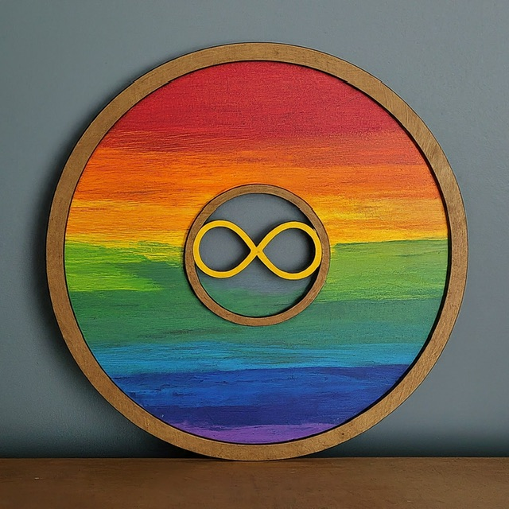

<h1>実写じゃないぞ、ロゴだぞ</h1>

どうも!The Infinity'sです!最近は<a
target="_parent"
href="https://www.google.co.jp/search?q=%E4%BA%BA%E5%B7%A5%E7%9F%A5%E8%83%BD"
>AI(人工知能)</a
>
が凄い勢いで発展していますよね！
<a target="_parent" href="https://gemini.google.com/">Gemini</a>や、
<a target="_parent" href="https://chat.openai.com/">ChatGPT</a>、
<a target="_parent" href="http://copilot.microsoft.com/">Copilot</a
>のように、様々な企業・団体がAIを公開しています!

一方で、将棋やチェスなどの大会でAIを使用した不正が行われたり、画像生成AIを使って画像を出力・公開するだけの人が、 
あたかも絵を描いているかのように「<a
target="_parent"
href="https://the-infinitys.f5.si/blog?name=To_all_AI_artists_who_call_themselves_AI_engineers"
>AI絵師</a
>」と呼ばれていたりと、色々問題点も多いです。

そんな中で、私はふと思いました...

<h5>「自分の画像をAIに学習させたらどうなるんだろう...」</h5>

と。ということで

こいつを召喚、そして手持ちのAI(Gemini)に、この画像をインポートさせ、これを元に絵を描くように指示...

<h2>結果</h2>

 

 

 

 

<h2>作ってみた感想</h2>

実写感が半端ない。灰色の背景に木・プラスチック・金属的質感がある丸っこい物体を作って虹色に塗ったという感じ...

綺麗...٩( ᐛ )و

頼むのでGoogleAdsense合格させてください

<date>2024/06/04</date>