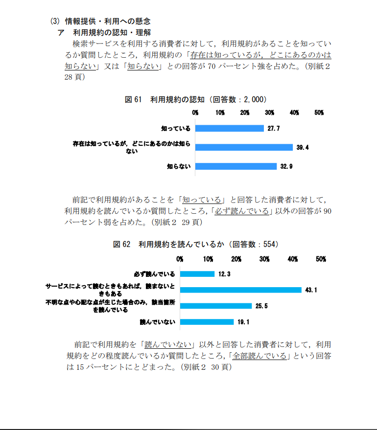

# title: リミックス文化を理解すること

## Remix をするということ

(Scratch での話なので多分 Scratch をやっていない人にはわかりません)
最近 Scratch をやっていて、気になる文章を見つけました。

**「リミックスを許可した覚えはありません」**

許可した覚えが無い...?一瞬何が書かれているのかを理解することができませんでした。
でもこう言った文章は意外にも多いものです。例えば、

- リミックス禁止
- リミックスする前に私に言って下さい
- 許可なくリミックスをしないでください

などなど...

大体の人(特に Scratch をやっていない人)にわかりやすいように説明すると、
Scratch におけるリミックスというのは、

> 他人のプロジェクトを複製して自分好みに改変することができる、Scratch の特徴的な機能[^1]
> (
> [^1]: [Scratch wiki リミックスとは](https://ja.scratch-wiki.info/wiki/リミックス)
> )

というものです。...全然分かり辛いな...要するに人の作ったものをアレンジする機能って感じですね。
この機能(リミックス)は Scratch でプロジェクト(作品)を作って公開した時点で自動的に許可されるものであるのであります()
そしてこの旨は利用規約、及び Scratch のコミュニティーガイドラインに明記されています。**しかし！**誰も利用規約なんぞ読みません ٩( ᐛ )و
悲しきかな、大体の人は利用規約を読まないというデータがあるんだ...え？ソースはどこかって？

こ ↑ こ ↓

> [^2]
> 
> [^2]: [デジタル広告の取引実態に関する中間報告書 by 公正取引委員会](https://www.jftc.go.jp/houdou/pressrelease/2020/apr/digital/200428betten.pdf)

利用規約の認知率で、
存在は知っているが、どこにあるのかは知らないという人と、
存在すら知らないという人が 72.3%を占めている。
また、利用規約があることを知っている人のうち、必ず読む人は、たったの 12.3%である。
要するに、3.4071%の人しか、利用規約をしっかり読んで、いないということである。

そういうこともあって、このことを知らない人は、非常に多いのであります。
皆さんはそういったようにならないように気をつけましょう！
<date>2024/06/13</date>