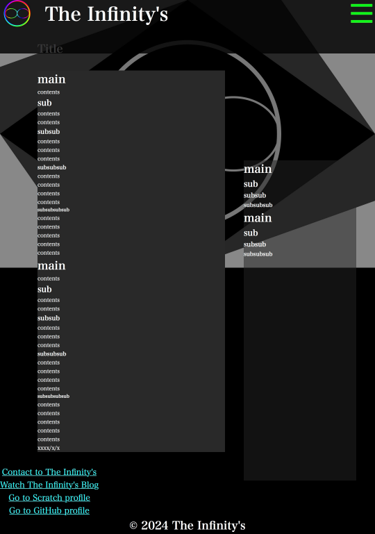

<h1>Blogを更新しました</h1>
<h2>ダサすぎたデザイン</h2>

?????????????????????
「ブログを更新って...当たり前のことじゃないの？」
違う違う、そうじゃない。前々から、blogのデザインがダサいなー...って気になってたから、
GitHubに暫く籠ることにしたのを期に、ページのデザインをもっと勉強しようと思って、
それで、ブログを「更新」しました。

<h2>ちょっと何言ってるかよくわからない</h2>

わからないでしょう...私だってさっぱりです٩( ᐛ )و 
ブログを更新っていうのは、新しくブログ記事を書いたとか、そういうのじゃなくて、
ブログ自体の仕組みを変えたって意味。
もっと具体的にいうなら、ほら、今のURLを見てごらん？前まではずっと"https://the-infinitys.*.*/blog/"だったでしょ？
インラインで全部表示しようとして、無茶をして、あの滅茶苦茶なデザインになってたんよ...
で、このままだと不味いなって思って、大幅に変えることにしました。
ブログってどんな感じの見た目だったっけ...って思いながら、あちこちでブログを調べて回ったりして、
一生懸命探しました。

<h2>で、結局何をやったの？</h2>

先ずは、見ての通り、URLが<strong>article</strong>に変わりました。
その結果、前まではiframeでやってた関係でいちいちaタグにtarget="_parent"属性を付けずに済むようになりました。
その上、 cssを、<a href="../../main.css">main.css</a>から、<a
href="../../Infinity-style/style.css"
>Infinity-style</a
>に変えました。具体的に何が変わったかというと、他のブログサイトと同じようなデザインに変わったということです。 
さらに、インデックス機能も付けました。右側に、=> 
目次みたいに文字が並んでると思います。それがインデックスです。そこのところをクリックすると、対応する部分まで移動することができます。
ちなみにこれは<a href="../../Infinity-style/script.js"
>Infinity-stylejs</a
>でやるようにしています。
これを適用することで、前と書き方を変えずに自動的に、 

<h5>1.ブログの記事をボックスに収めて、</h5>
<h5>2.タイトルを上に表示して、</h5>
<h5>3.インデックスを作成して、</h5>
<h5>4.デザインを整える</h5>
といったことが自動でできます。
<h2>なんでこんなことを？</h2>

さっき言ったでしょう。読みなさい

<h2>他のブログの表示がおかしいのは、？</h2>

知らん。放っておけ

<h2>どんな感じに表示されるの？</h2>

<h2>最後に</h2>

糞程面倒だったけど、これはすごく役にたつ。

<date>2024/06/07</date>