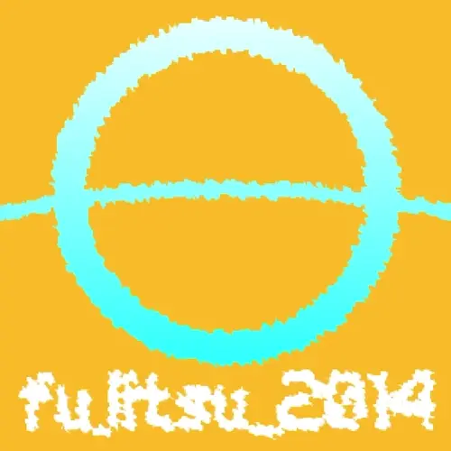
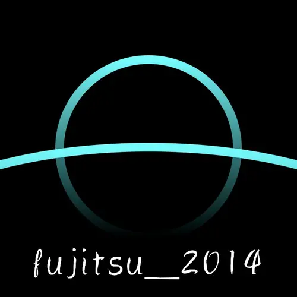

# title: アイコンを作って欲しいとのことで早速作りました。

## 事の始まり
ある日(今日)、[とある人](https://scratch.mit.edu/users/fujitsu_2014)にアイコンを作って欲しいと頼まれました。
なので早速作ります。

## どうやって作るのか
fujitsuという言葉がまあ気になりますが、取り敢えず富士山カラーと夕焼けと蜃気楼をイメージして適当なものを作ります。

### 追記
新しく作り直しました

# date: 2024/07/02
