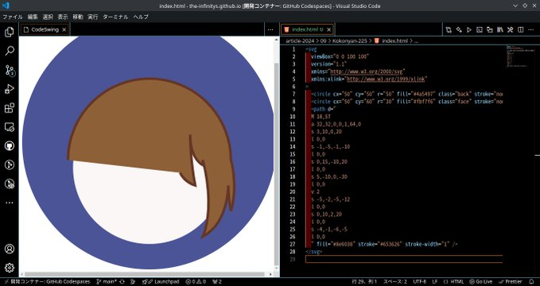
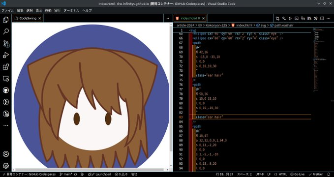

# 『生物の』絵を書いてみた！

どうも！ The Infinity's です！
私って絵が下手糞なんですよね...
絵の練習を兼ねて...

[ここにゃん](https://scratch.mit.edu/users/Kokonyan-225/)
さんの絵を"書いて"みることにしました！
という訳で、早速対象の絵を見てみましょう！

<style>
  img.article-imgs{
    width:100%;
    height:auto;
  }
</style>

<a href="https://scratch.mit.edu/projects/645241645/">
  
</a>
<a href="https://scratch.mit.edu/projects/676788547/">
  
</a>
<a href="https://scratch.mit.edu/projects/781522546/">
  
</a>

うん！**いつ見ても素晴らしい**！()

## 実際に書いてみた

使用ソフトはVSCodeです。


を元にして書きます。


先ずは色を取って...



前髪をセットし...


後ろ髪をセット...


短いので修正


目を足す


耳をつけて...



耳毛をつけるために前髪を引っ剥がす...


そして完成！


アイコン風に仕立て上げました！此れしか出来ないんです！()

因みにコードはこっちです！

```svg
<svg
  viewBox="0 0 100 100"
  version="1.1"
  xmlns="http://www.w3.org/2000/svg"
  xmlns:xlink="http://www.w3.org/1999/xlink"
>
  <defs>
    <style>
      .wear {
        fill: #4a5497;
        stroke: none;
      }
      .skin {
        fill: #fbf7f6;
        stroke: none;
      }
      .hair {
        fill: #8e6038;
        stroke: #653626;
        stroke-width: 1;
      }
      .ear.hair {
        fill: none;
      }
      .ear.skin {
        stroke: #653626;
        stroke-width: 1;
      }
      .eye {
        fill: #522f11;
        stroke: none;
      }
    </style>
  </defs>
  <circle cx="50" cy="50" r="50" class="wear" />
  <path
    d="
    M 18,47
    a 32,32,0,0,1,64,0
    s 2,13,3,38
    l 0,0
    s -3,-5,-4,-10
    s 1,5,-4,14
    l 0,0
    s -3,-5,-4,-10
    s 1,5,-4,13
    l 0,0
    s -3,-5,-4,-10
    s 1,5,-4,12
    l 0,0
    s -3,-5,-4,-10
    s 1,5,-4,11
    l 0,0
    s -3,-5,-4,-10
    s 1,5,-4,10
    l 0,0
    s -3,-5,-4,-10
    s 1,5,-4,9
    l 0,0
    s -3,-5,-4,-10
    s 1,5,-4,8
    l 0,0
    s -3,-5,-4,-10
    s 1,2,-4,5
    l 0,0
    s -10,-20,-1,-50
    z
    "
    class="behind hair"
  />
  <circle cx="50" cy="50" r="30" class="skin" />
  <ellipse cx="40" cy="60" rx="2" ry="4" class="eye" />
  <ellipse cx="60" cy="60" rx="2" ry="4" class="eye" />
  <path
    d="
    M 42,16
    s -15,0 -33,10
    l 0,0
    s 0,10,10,30
    "
    class="hair"
  />
  <path
    d="
    M 58,16
    s 15,0 33,10
    l 0,0
    s 0,10,-10,30
    "
    class="hair"
  />
  <path
    d="
    M 78,28
    l 5,1
    l -2,1
    s 0,5,-3,10
    v -5
    s 0,1,-3,5
    L 70,32
    z
    "
    class="ear skin"
  />
  <path
    d="
    M 70,32
    s 5,-5,16,-5
    "
    class="ear hair"
  />
  <path
    d="
    M 22,28
    l -5,1
    l 2,1
    s 0,5,3,10
    v -5
    s 0,1,3,5
    L 30,32
    z
    "
    class="ear skin"
  />
  <path
    d="
    M 30,32
    s -5,-5,-16,-5
    "
    class="ear hair"
  />
  <path
    d="
    M 18,47
    a 32,32,0,0,1,64,0
    s 0,13,-2,20
    l 0,0
    s 1,-5,-1,-10
    l 0,0
    s 0,15,-8,20
    l 0,0
    s 5,-10,0,-30
    l 0,0
    v 2
    s -5,-2,-5,-12
    l 0,0
    s 0,10,2,20
    l 0,0
    s -4,-1,-6,-5
    l 0,0
    v 5
    s -7,-3,-12,-15
    l 0,0
    s -1,2,2,12
    l 0,0
    s -10,-10,-10,-30
    l 0,0
    s 0,5,2,15
    l 0,0
    s -4,4,-4,14
    l 0,0
    s -7,-3,-12,-15
    l 0,0
    s 3,8,5,10
    l 0,0
    s -5,15,-5,25
    l 0,0
    s -6,-5,-5,-20
    l 0,0
    s -1,5,1,12
    l 0,0
    s -6,-4,-6,-18
    z
    "
    class="front hair"
  />
</svg>
```

### クレジット

[@Kokonyan-225](https://scratch.mit.edu/users/Kokonyan-225/)
それぞれの画像のクレジットはリンクとして内蔵させています。

## 感想
書いていて楽しかったのですが...
**二度とやりたくない**です()


# date: 2024/09/11
