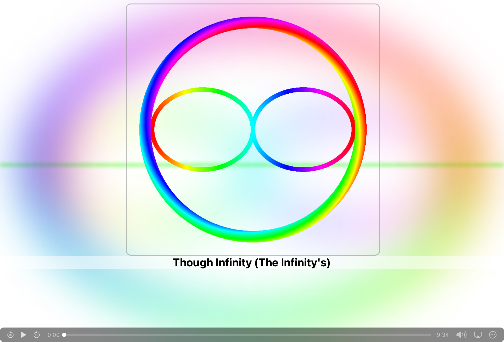

# 音楽プレイヤーを作ってみた

## きっかけはいつもそこに

どうも！The Infinity'sです！
最近楽曲の投稿が増えてきて、
ジャケットと音源だけを出すのもあれだなぁ...
と思ったので、
楽曲を出す際に使えそうな**音楽プレイヤー**を作ってみました！

## コンセプト

音楽の再生や停止などの操作は、デフォルトでついているブラウザの機能に任せて、
任意でジャケットや音楽、タイトルなどを自由に変更できるようなイコライザ付きのプレイヤー
を作ろうと考えました。

## 作るにあたって

今回、この音楽プレイヤーを作る際、一からコードを作るのは少し大変だったので、
過去に作っていた、[Scratch用アナライザ](/Scratch/audioPlayer/)から一部プログラムを持ってきました。

## 完成図

このような感じになりました。



URLは[/app/audio-player/](/app/audio-player/)です。

## プログラム

### HTML

```html
<!DOCTYPE html>
<html lang="ja">
  <head>
    <meta charset="UTF-8" />
    <meta name="viewport" content="width=device-width, initial-scale=1.0" />
    <title>audio player</title>
    <link rel="stylesheet" href="./style.css" />
    <script defer src="./script.js"></script>
  </head>
  <body>
    <div class="control">
      <h1 class="music-title"></h1>
      <div class="container"></div>
    </div>
    <audio crossorigin="anonymous" controls src="" id="audio"></audio>
  </body>
</html>
```

### CSS

```css
* {
  position: relative;
  padding: 0;
  margin: 0;
}

:root {
  --jacket-size: min(90vw, 50vmax);
}

div.control {
  width: 100%;
  height: calc(100%-24px);
  display: flex;
  align-items: stretch;
  flex-direction: column;
}

#audio {
  position: fixed;
  bottom: 0;
  left: 0;
  width: 100%;
  height: 24px;
}

.bg {
  position: fixed;
  width: 100%;
  height: 100%;
  top: 0;
  left: 0;
  filter: blur(50px);
}

img.jacket {
  width: var(--jacket-size);
  aspect-ratio: 1/1;
  margin-top: 10px;
  margin-left: calc((100% - var(--jacket-size)) / 2);
  border: 2px solid #8888;
  border-radius: 10px;
}

h1.music-title {
  color: #000;
  background:#fff8;
  border-radius: 5px;
  font-family: system-ui, -apple-system, BlinkMacSystemFont, 'Segoe UI', Roboto, Oxygen, Ubuntu, Cantarell, 'Open Sans', 'Helvetica Neue', sans-serif;
  font-size: 24px;
  text-align: center;
  left: 50%;
  transform: translate(-50%, 0);
}

/* 親 */
.container {
  position: fixed;
  width: 100%;
  height: calc(100% - 24px);
  top: 0;
  left: 0;
  z-index: -1000;
  opacity: 0.5;
  filter: blur(4px);
  display: flex;
  justify-content: center;
  align-items: center;
  gap: 1px;
}

.container:after {
  content: "";
  display: block;
  width: 100%;
  height: 1px;
  position: absolute;
  top: 50%;
  left: 0;
}

.box {
  flex: 1;
  height: 95%;
  scale: 1 0.01;
  animation: 10s rainbow-animation linear infinite;
}


@keyframes rainbow-animation {
  0% {
    background-color: #f00;
  }

  17% {
    background-color: #ff0;
  }

  33% {
    background-color: #0f0;
  }

  50% {
    background-color: #0ff;
  }

  67% {
    background-color: #00f;
  }

  83% {
    background-color: #f0f;
  }

  100% {
    background-color: #f00;
  }
}
```

### JavaScript

```javascript
const controller =document.querySelector("div.control");
const audio = document.querySelector("#audio");
const get_audio_url = () => {
  const default_audio =
    "https://develop.the-infinitys.f5.si/article-2024/09/through-infinity/Through-Infinity.mp3";
  const param_audio = new URLSearchParams(document.location.search).get(
    "audio"
  );
  return param_audio == null ? default_audio : param_audio;
};
audio.src = get_audio_url();
const add_bg = () => {
  const get_image_url = () => {
    const default_img =
      "https://develop.the-infinitys.f5.si/image/The-Infinitys.webp";
    const param_img = new URLSearchParams(document.location.search).get("img");
    return param_img == null ? default_img : param_img;
  };
  const jacket = document.createElement("img");
  jacket.src = get_image_url();
  jacket.className = "jacket";
  jacket.setAttribute("crossorigin", "anonymous");
  controller.prepend(jacket);
  const bg = document.createElement("img");
  bg.src = get_image_url();
  bg.className = "bg";
  bg.setAttribute("crossorigin", "anonymous");
  document.body.prepend(bg);
};
add_bg();
const set_title = () => {
  const default_title = "Though Infinity (The Infinity's) ";
  const param_title = new URLSearchParams(document.location.search).get(
    "title"
  );
  document.querySelector("h1.music-title").innerHTML =
    param_title == null ? default_title : param_title;
};
set_title();
let already_inited = false;
const containerElement = document.querySelector(".container");
const FFT_SIZE = 64;
function init_container() {
  containerElement.innerHTML = "";
  for (let i = 0; i < FFT_SIZE / 2; i++) {
    const div = document.createElement("div");
    div.classList.add("box");
    containerElement.append(div);
  }
}
init_container();
function init() {
  if (already_inited) {
    return;
  }
  already_inited = true;
  const boxes = containerElement.children;
  const context = new AudioContext();
  // アナライザーを生成
  const nodeAnalyser = context.createAnalyser();
  // フーリエ変換を行う分割数。2の乗数でなくてはならない
  nodeAnalyser.fftSize = FFT_SIZE;
  // 0～1の範囲でデータの動きの速さ 0だともっとも速く、1に近づくほど遅くなる
  nodeAnalyser.smoothingTimeConstant = 0.8;
  // オーディオの出力先を設定
  nodeAnalyser.connect(context.destination);
  // audio 要素と紐付ける
  const nodeSource = context.createMediaElementSource(audio);
  nodeSource.connect(nodeAnalyser);
  function loop() {
    const freqByteData = new Uint8Array(FFT_SIZE / 2);
    nodeAnalyser.getByteFrequencyData(freqByteData);
    for (let i = 0; i < freqByteData.length; i++) {
      const freqSum = freqByteData[i];
      const scale = freqSum / 256;
      const div = boxes[i];
      div.style.scale = `1 ${scale * 0.99 + 0.01}`;
    }
    requestAnimationFrame(loop);
  }
  loop();
}
audio.addEventListener("play", init);
```

## 仕組み

URLパラメーターから、
 - img: ジャケット画像
 - audio: 音楽
 - title: 曲名
のデータを取得し、それに応じて要素を組むようになっています。

最初に音楽が再生された時に、アナライザの初期化をして、以後その音楽に応じて、
アナライザが動くようになっています。なので、
`init`内の`loop`関数を弄ることで、アナライザの挙動を変えたりもできます。
(例えばcanvasにアナライザを描くようにしたり)

パラメーターは全てURLから取得するようになっているので、どこの場所のものでも取得できて便利です。

## 作った感想

構想を練っている間はかなり大変でしたが、プログラムを組んでいるときは軽快に指が動き、
非常に楽しかったです。
一番大変だったのはデザインです()

# date: 2024/10/20
