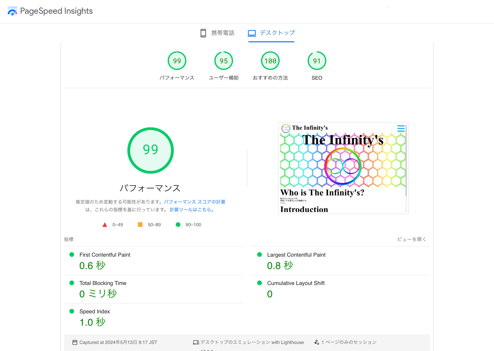

<h1>SEOやってみた！(その2)</h1>

前回の<a target="_parent" href="/blog?name=SEO_1"
>SEO対策やってみた(その1)</a
>から大体一月程経ちました...

あれから色々と調べながら、SEO評価を上げる方法をひたすら模索していました。

というわけでいきなりですが....

<h2><b>結果</b></h2>
<a
target="_parent"
href="https://pagespeed.web.dev/analysis/https-the-infinitys-f5-si/hml8e5qijr?form_factor=mobile">

画像をタップして結果のページに移動

</a>

結果は...

<table style="border: 2px solid #888888">

<tr>
<th>項目</th>
<th>点数</th>
</tr>
<tr>
<th>パフォーマンス</th>
<th>99</th>
</tr>
<tr>
<th>ユーザー補助</th>
<th>95</th>
</tr>
<tr>
<th>おすすめの方法</th>
<th>100</th>
</tr>
<tr>
<th>SEO</th>
<th>91</th>
</tr>
</table>
<h3><b style="font-size: 33%">ヨシ！</b></h3>

うん! 最高だ! どの項目も90点以上になっている!

苦労して色々やった甲斐があった！

<h2>SEO対策でやったこと</h2>

先ずはSEO対策をするにあたって、<b>知識が全く無かった</b>ので、

<a target="_parent" href="https://google.com/search?q=SEO"
>検索します</a
>

SEOとは、<b>Search Engine Optimization</b
>の略で、検索エンジン最適化という意味を持つ

という事だそうです

難しい...

まあ調べたところで私にはあんまり意味が無かったので、早速作業に取り掛かります

<h3>1.画像ファイルの最適化</h3>

Googleさんが言うには、「画像はjpegやpngを用いるよりも最新技術のwebpの方がいい」とのことです

(なんでwebpじゃないとダメなんだろうか...)とか考えているそこの君！

しばし話を聞いてくれたまへ()

<h4>画像圧縮の重要性</h4>

特にオンラインにおいて、画像などのデータ容量が多いサイトはあまり良いものではありません

読み込み速度は落ちるし、表示速度も落ちる、あと通信料金もたくさん食うし、サーバーに負荷が掛かる。

でそういうサイトはSEO対策にも宜しく無い。あと普通に遅いのはストレス

みんなもそう言う経験ない？例えばYouTube&reg;で動画を見てる時に、あのグルグルが表示されたら...イラッ卐としない？

要するにそう言うことよ...

イラッとしたらﾃﾞｰﾝ

☭

...ってなりかねないでしょ？٩( ᐛ )و(わかる人にはわかる

ソビエト社会主義人民共和国

)

そうなってしまったらもしかしたら2度とサイト訪れてくれなくなるじゃん？

困るんよ...()

だから居る。圧縮は。

<h5>png</h5>

png(Portable Netwrok
Graphics)形式は可逆圧縮(品質が落ちたりしない完全に復元ができる)画像の一種で、Scratchのビットマップ画像にも用いられているんだ。

画質とかも凄く良いんだけど...ちょっと容量が多い。

jpeg(Joint Photographic Experts
Group)形式は非可逆圧縮(品質が落ちて完全に復元するのが不可能)画像の一種で、主にカメラとかの写真を保存する形式として使われているんだ。

容量的には元の画像の10%くらいまで落とせて凄くいい。あとグラデーションも綺麗にできる。

けど画質がちょっとね...うん。アイコンとかの画像をjpegにすると、ブロックノイズというものができて品質が悲惨になるんだよね...

そこで新しくできたのがwebpと言うことです。

他にやったのはね...
<a target="_parent" href="/blog?name=make_API">Blog APIを作った</a
>りとか...

まあそれくらい。結局大事なのはそんなのよりもどれくらいそれっぽいデザインにできるかなんだよ...(私に一番欠けているもの)٩(
ᐛ )و

<date>2024/05/13</date>