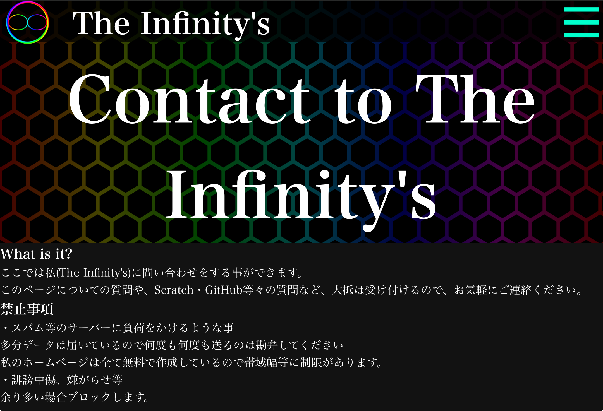

<h1>Language Support</h1>

つい最近contactページを作成しました。

Google Formを埋め込んで、データを楽に受け取れるようにしてます。

でこれを運用し始めて早一日...

<h4>
"I have a question about the operation of the site, do you plan to
implement an English version?"
</h4>
<h4>
「サイトの運営について質問があるのですが、英語版を導入する予定はありますか？」
</h4>

と来ました。ビックリです。英語で来るとは...驚いた...

(写真)

そういうわけでさっそくつくることにしました。

といっても多言語対応なんてやったことがなかったので、調べます

...

...

...

方法は結構あるみたいですね

<h2>多言語対応の方法</h2>
<h3>1.ドメインを分けてそれぞれで作る</h3>

ドメインの入手が金をかけないと困難だったので却下

<h3>2.ディレクトリを分けてそれぞれで作る</h3>

複数同じページを書くことや更新が面倒臭いので、却下

<h3>3.GOOGLE翻訳</h3>

SEO対策的に却下

<h2>結果</h2>
<h3>「自作すること」</h3>

にしました。というわけでプログラムを組んでいきましょう。

主なコンセプトとしては、

・保守/更新が簡単

・軽い

といった点を重視したので、コードは共通で、データはjsonでそれぞれのディレクトリに入れることにします。

<a
target="_parent"
href="https://github.com/The-Infinitys/the-infinitys.github.io/blob/main/layout/language-support.js"
>view language-support.js</a
>

まずはプログラム、language-support.jsです。

仕組みとしては...

1.翻訳を実行する関数を定義(translate_Infinitys)

2.main関数を定義

3.実行

というステップになっています。

というわけで2について詳しく説明します。

まずは、navigator.languageから言語を取得します。

その上で、もしlangパラメータが存在していれば、それでlanguageを上書きをします。

次に、現在地のURLから、language.jsonファイルの場所を計算し、

fetch()。で成功したら、jsonファイルとして読み込み、それも成功したら、translate_Infinitys()を実行します。

この時にエラーが出た際はalertで再読み込みを促します。

そして、データ、language.jsonです。

<a
target="_parent"
href="https://github.com/The-Infinitys/the-infinitys.github.io/blob/main/language.json"
>view language.json</a
>

構造としては、普通にオブジェクト内に、対応している言語のキー(en,en-USとか)をいれて、

それぞれに配列をセット。でその配列内には、

<code>
<pre>{</pre>
<pre>"elem":"エレメントのセレクタ"</pre>
<pre>"text":"置き換えるテキスト"</pre>
<pre>}</pre>
</code>

というふうな構造の変換データを入れておきます。これで完成です。

プログラムは変えなくてもどこでも融通が効くし、なんなら別ドメインでも行けちゃう。

さらに更新する必要があるのはjsonファイル一つだけなので、そこも便利。

個人的には超満足な出来です。

というわけでUnknownさん。ありがとうございました!

以上!2024年5月最後のThe Infinity'sのブログでした!

<date>2024/05/31</date>