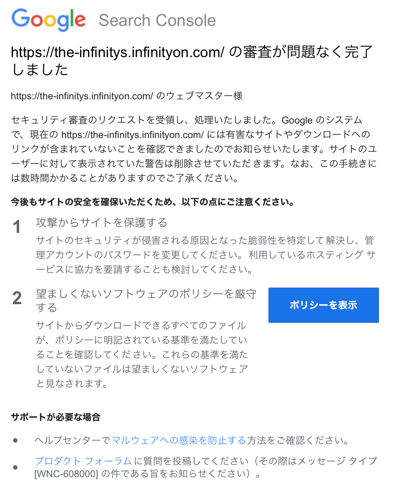

# 何もしていないのにも関わらず勝手に有害サイト扱いされた件
はい。こちらの画像の通りです。

Googleさん曰くですね...

<strong>
これらのページは、ユーザーを騙して危険な操作（望ましくないソフトウェアのインストール、個人情報の公開など）を実行させようとしています。
</strong>
...だそうです。

???????????????????????

ちょっと何を言っているのか分からないです...

このサイト(The-Infinitysのホームページ)は、フィルタリングの厳しいお子様でもしっかり閲覧できるように、

<strong>複数のドメインが存在しています。</strong>

で、他のページでは何も問題なかったので、恐らく...ドメインのせいですね...

最近良いドメインないかなと思ってFreeDNSってやつで超それっぽいもの"infinityon.com"を使用しているのですが...

それだけでこんなことになるのかな...???????????????????????

Googleさん、どうかしっかり見てください

追記

再審査の依頼をしたすぐ翌日、

審査が完了したことを伝えるメールが来ました！

助かったよ...(普通に合格した)

