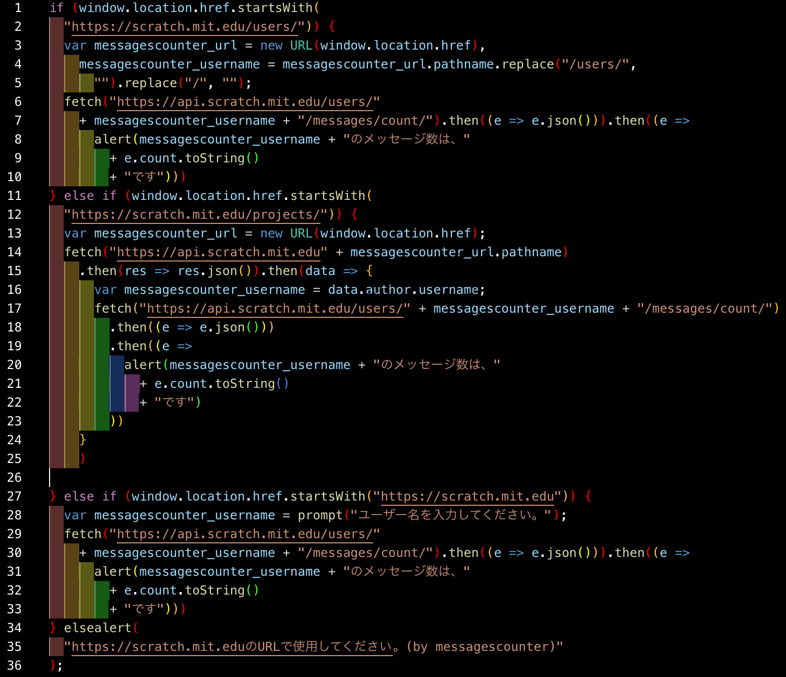

<h1>Scratch messages counter</h1>

どもども!6月最初のブログだZE⭐️!The Infinity'sです！

最近、ふと思ったことがあるんです。もしも他のScratcherが活動しているか見れたら便利だなーぁ...

って。そういうわけで作ることにします。

おもな仕組みとしては、

1.場所(現在地のURL)を取得

2.ユーザー名が取れたら、とる。

3.でなければ任意の値を入れさせる

4.ユーザー名からメッセージ数をfetch

5.表示

というふうにするつもりです。

作りました。

で、このデータを元にして...<a
target="_parent"
href="https://google.com/search?q=ブックマークレット"
>ブックマークレット</a
>を作成します。

<a
href="javascript:if(window.location.href.startsWith(%22https://scratch.mit.edu/users/%22))%7Bvar%20messagescounter_username=(messagescounter_url=new%20URL(window.location.href)).pathname.replace(%22/users/%22,%22%22).replace(%22/%22,%22%22);fetch(%22https://api.scratch.mit.edu/users/%22+messagescounter_username+%22/messages/count/%22).then((e=%3Ee.json())).then((e=%3Ealert(messagescounter_username+%22%E3%81%AE%E3%83%A1%E3%83%83%E3%82%BB%E3%83%BC%E3%82%B8%E6%95%B0%E3%81%AF%E3%80%81%22+e.count.toString()+%22%E3%81%A7%E3%81%99%22)))%7Delse%20if(window.location.href.startsWith(%22https://scratch.mit.edu/projects/%22))%7Bvar%20messagescounter_url=new%20URL(window.location.href);fetch(%22https://api.scratch.mit.edu%22+messagescounter_url.pathname).then((e=%3Ee.json())).then((e=%3E%7Bvar%20t=e.author.username;fetch(%22https://api.scratch.mit.edu/users/%22+t+%22/messages/count/%22).then((e=%3Ee.json())).then((e=%3Ealert(t+%22%E3%81%AE%E3%83%A1%E3%83%83%E3%82%BB%E3%83%BC%E3%82%B8%E6%95%B0%E3%81%AF%E3%80%81%22+e.count.toString()+%22%E3%81%A7%E3%81%99%22)))%7D))%7Delse%20if(window.location.href.startsWith(%22https://scratch.mit.edu%22))%7Bmessagescounter_username=prompt(%22%E3%83%A6%E3%83%BC%E3%82%B6%E3%83%BC%E5%90%8D%E3%82%92%E5%85%A5%E5%8A%9B%E3%81%97%E3%81%A6%E3%81%8F%E3%81%A0%E3%81%95%E3%81%84%E3%80%82%22);fetch(%22https://api.scratch.mit.edu/users/%22+messagescounter_username+%22/messages/count/%22).then((e=%3Ee.json())).then((e=%3Ealert(messagescounter_username+%22%E3%81%AE%E3%83%A1%E3%83%83%E3%82%BB%E3%83%BC%E3%82%B8%E6%95%B0%E3%81%AF%E3%80%81%22+e.count.toString()+%22%E3%81%A7%E3%81%99%22)))%7Delsealert(%22https://scratch.mit.edu%E3%81%AEURL%E3%81%A7%E4%BD%BF%E7%94%A8%E3%81%97%E3%81%A6%E3%81%8F%E3%81%A0%E3%81%95%E3%81%84%E3%80%82(by%20messagescounter)%22);void(0);"
>完成品</a
>

今までこういった小物ツールをたくさん作ってきたので、結構簡単でした。

<date>2024/06/01</date>