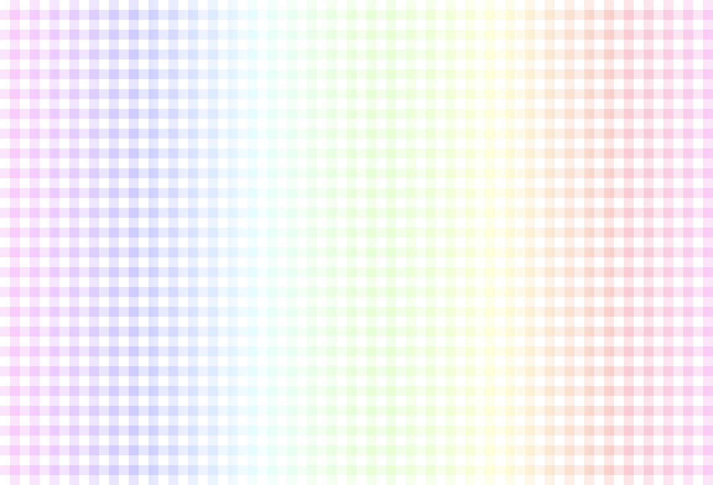

# ギンガムチェック

どうも！The Infinity'sです！
また新しく背景を作ってみました！


```javascript
const gingham_check = (): void => {
  const size = 30;
  const pattern: bg_pattern = {
    width: size * 2,
    height: size * 2,
    shift: [0],
    func: (ctx: CanvasRenderingContext2D, x: number, y: number) => {
      ctx.globalAlpha = 1;
      ctx.fillRect(x, y, size, size);
      ctx.globalAlpha = 0.9;
      ctx.fillRect(x + size, y, size, size);
      ctx.globalAlpha = 0.9;
      ctx.fillRect(x, y + size, size, size);
      ctx.globalAlpha = 0.8;
      ctx.fillRect(x + size, y + size, size, size);
    },
  };
  bg_func.rainbow.run(pattern, false);
  setTimeout(bg_func.rainbow.gingham_check, 100);
}
```

## 感謝を込めて

[みそにゃん](https://twitter.com/miso_cat225)さんにアイデアを頂きました！

ありがとうございます！

# date: 2024/10/16