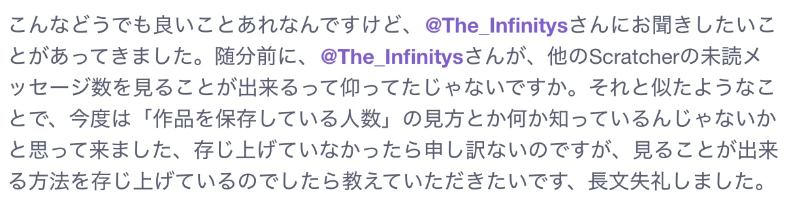

# Scratchの質問

どうも、The Infinity'sです。
Scratchの方で質問があったので返そうと思います。

## 質問内容

こんなどうでも良いことあれなんですけど、@The_Infinitysさんにお聞きしたいことがあってきました。
随分前に、@The_Infinitysさんが、
他のScratcherの未読メッセージ数を見ることが出来るって仰ってたじゃないですか。
それと似たようなことで、今度は「作品を保存している人数」の見方とか何か知っているんじゃないか
と思って来ました、
存じ上げていなかったら申し訳ないのですが、
見ることが出来る方法を存じ上げているのでしたら教えていただきたいです、長文失礼しました。

## 回答

作品を、**保存**している人数の確認方法ですか...
正当な方法で正確に数を確認をする方法は分からないですね...
Scratchの未読メッセージ数については、

`https://api.scratch.mit.edu/users/username/messages/count/`

というAPIがあるのですが、保存された回数を記録しているAPIは探した限りでは見当たらないです。

## 終わりに - 質問者へ

お役に立てず申し訳ないです。
この投稿に対する返信につきましては、Scratchの方で適当にやっていただけると幸いです。

# date: 2024/10/28