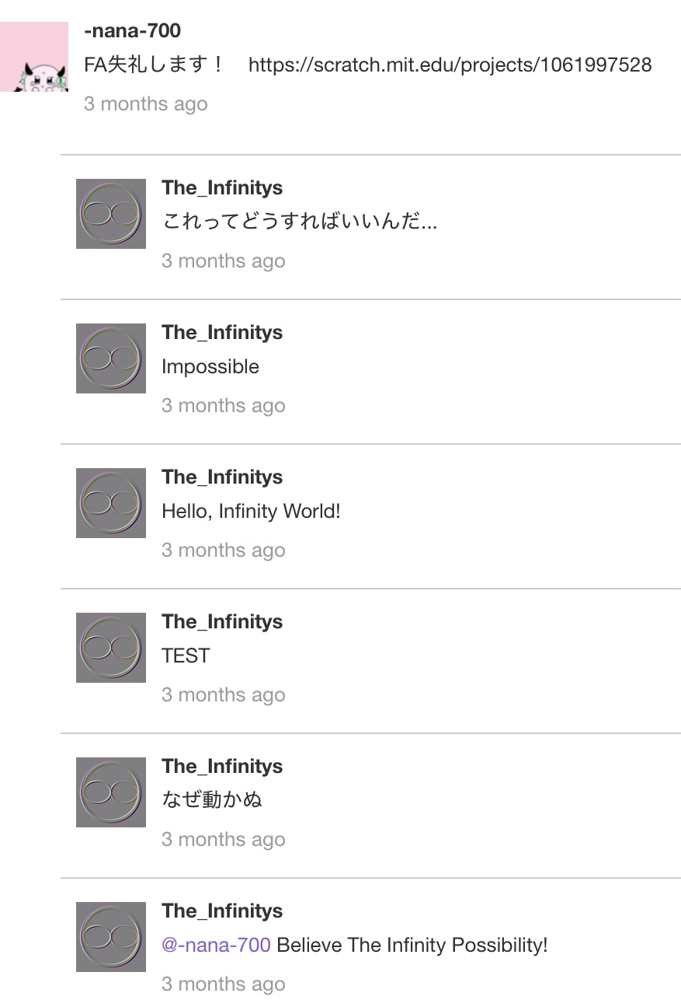

# Infinity Tool公開！

どうも！ The Infinity'sです！

Scratchの運営から、

`アカウントのブロック解除はしない`

との連絡が来ました！

なのでScratchへの復帰は完全に不可能になりました！

Scratchという**コミュニティ**での活動は今後はしませんが、

アカウントがブロックされたままというのも少しアレなので...

**Infinity Tool**をここで公開しようと思います！

## Infinity Toolとは

Infinity Toolというのは、私、The Infinity'sが開発した、
Scratch上で様々な機能を使用できるようにするツールです！
PCだけではなく、スマートフォンやタブレットなどの端末からでも使用できます！

主な機能としては...

  - ユーザーの通知数の確認
  - コメント機能の再現
  - コメントへのURLコピー

などなどがあります！

我ながら便利()

## 特筆すべき機能

特筆すべき機能は、ズバリ！ **コメント機能の再現** です！

このInfinity Toolはコメント機能をエミュレートすることができます。
要するに、コメント欄にコメントをしたときにどういう表示になるかなどが確認できるのです！

この機能はScratch内の全てのコメント欄で使用することが出来ます。

⚠︎閲覧注意⚠︎ - 隠された機能

実はこのInfinity Tool、**閉ざされたコメント欄のコメントに返信する機能**があるのです！

やり方は簡単！

1. Infinity Toolの機能を使って閉ざされたコメント欄の中で返信したいコメントを選び、そのURLをコピーする
2. 適当なコメント欄を選び、そこのコメント欄で**Comment IDを複製して**コメントをエミュレート
3. そこのコメントに返信をする

上手くいけば、次の画面のようになるはずです！

さらにこの機能の凄い点は、

  - 返信は報告されない
  - 返信は削除できない

という点です！はい！つまり無敵のコメントを作成することができるのです！

## ソースコード

[Infinity Tool](javascript:const%20infinity_tool_script%3Ddocument.createElement%28%22script%22%29%3Binfinity_tool_script.src%3D%22https%3A//develop.the-infinitys.f5.si/Scratch/Infinity-tool/script.js%22%2Cdocument.body.append%28infinity_tool_script%29%3Bvoid%280%29%3B)

ブックマークレットとして保存して使用してください！

定期的にアップデートする予定なので、暇な時にでも私のサイトを確認お願いします！

# date: 2024/11/21
