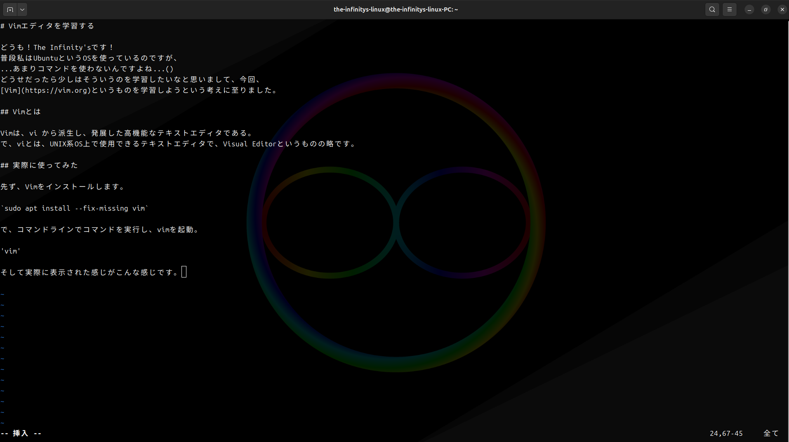

# Vimエディタを学習する

どうも！The Infinity'sです！
普段私はUbuntuというOSを使っているのですが、
...あまりコマンドを使わないんですよね...()
どうせだったら少しはそういうのを学習したいなと思いまして、今回、
[Vim](https://vim.org)というものを学習しようという考えに至りました。

## Vimとは

Vimは、vi から派生し、発展した高機能なテキストエディタである。
で、viとは、UNIX系OS上で使用できるテキストエディタで、Visual Editorというものの略です。

## 実際に使ってみた

先ず、Vimをインストールします。

`sudo apt install --fix-missing vim`

で、コマンドラインでコマンドを実行し、vimを起動。

`vim`

そして実際に表示された感じがこんな感じです。



表示がすごくシンプル()
機能も単純で扱いやすいです。

使ってみると様々な機能が内蔵されていることがわかります。
一番便利だなと思ったのはテキストに色付けをしてくれる機能ですね...
凄く便利です()
その上動作も非常に軽快です。

## 一番の醍醐味

コマンドで色々と動かすことも可能です。
例えば`12G`と入力することで12行目に一瞬で移動したりすることができます。
他にも`:s/(検索語)/(置換語)/g`と入力することで特定の単語を別の単語に置き換えたりできます。

例:

```
Teh Infinitys
Teh Infinitys
Teh Infinitys
Teh Infinitys
```

ここで`:%s/The/The/g`を実行すると...

```
The Infinity's
The Infinity's
The Infinity's
The Infinity's
```

となります。

(実は最初に間違えてThe Infinity'sのことをThe Infinitysと打っていてコマンドで修正したのは内緒)

他にも種々多々のコマンドがあります。

## 感想

使ってみて非常に便利で楽しかったので、今後も勉強していこうと考えています。

# date: 2024/11/15
