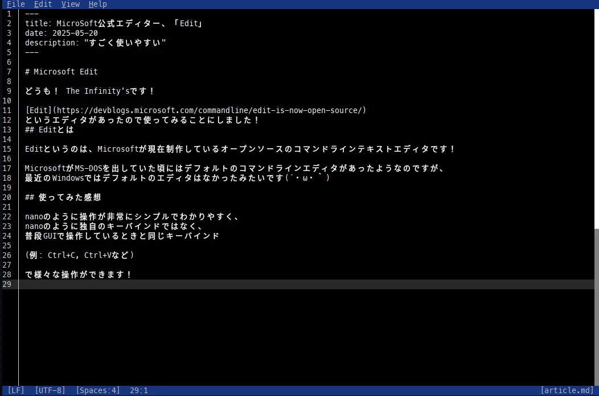

# Microsoft Edit

I decided to try out an editor called [Edit](https://devblogs.microsoft.com/commandline/edit-is-now-open-source/)!

## What is Edit?

Edit is an open-source command-line text editor currently being developed by Microsoft!

Back when Microsoft released MS-DOS, there was a default command-line editor, but it seems recent versions of Windows didn’t have a default editor (´・ω・｀).

## My Experience Using It

The operation is very simple and easy to understand, like nano, but instead of nano’s unique keybindings, it uses the same keybindings as those used in GUI environments

(Example: Ctrl+C, Ctrl+V, etc.)

for various operations!

Yes, it’s even easier to use than the nano editor.

If I had to nitpick... I wish it had syntax highlighting (code coloring, etc.).

## In Conclusion

Everyone, please give it a try!