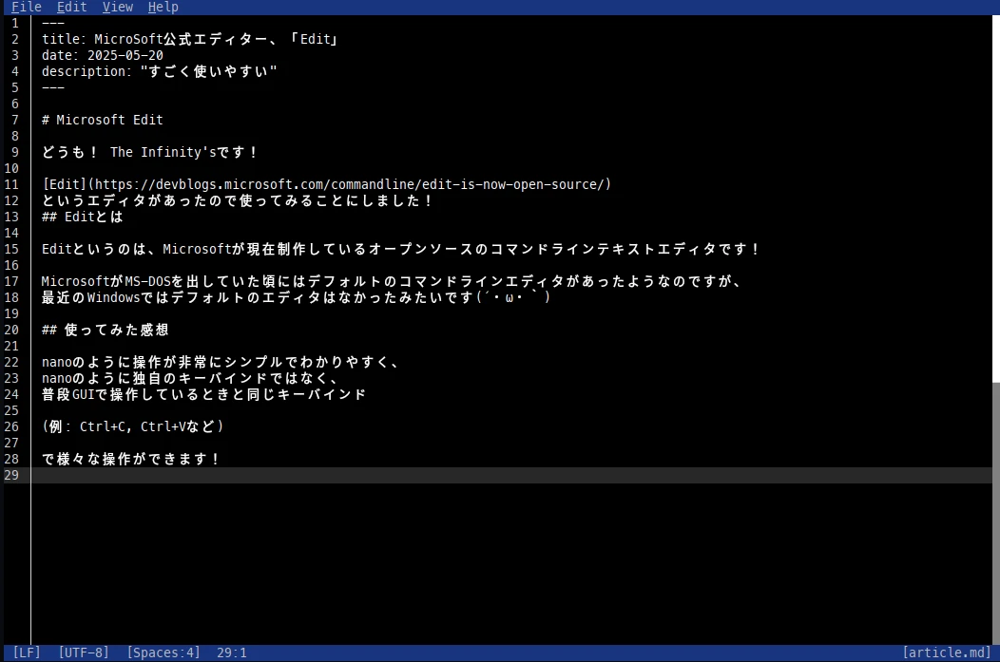

--- 
title: "MicroSoft公式エディター、「Edit」"
date: "2025-05-20"
description: "すごく使いやすい"
---

# Microsoft Edit

どうも！ The Infinity'sです！

[Edit](https://devblogs.microsoft.com/commandline/edit-is-now-open-source/)
というエディタがあったので使ってみることにしました！

## Editとは

Editというのは、Microsoftが現在制作しているオープンソースのコマンドラインテキストエディタです！

MicrosoftがMS-DOSを出していた頃にはデフォルトのコマンドラインエディタがあったようなのですが、
最近のWindowsではデフォルトのエディタはなかったみたいです(´・ω・｀)

## 使ってみた感想

nanoのように操作が非常にシンプルでわかりやすく、
nanoのように独自のキーバインドではなく、
普段GUIで操作しているときと同じキーバインド

(例: Ctrl+C, Ctrl+Vなど)

で様々な操作ができます！

はい、nanoエディターよりも使いやすいです。

強いて言うなら...シンタックス(コードの色付けなど)があればよかったかなと思っています。

## 終わりに

みなさんもぜひ使ってみてくださいね！
