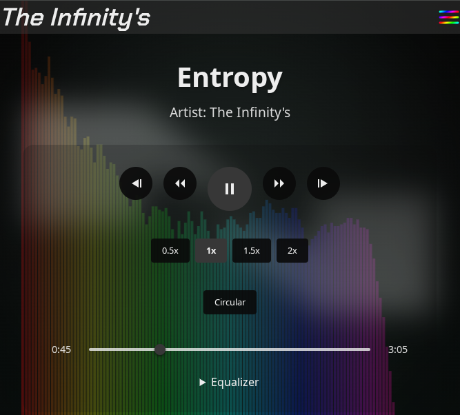

# Section of music

どうも！ The Infinity'sです！

私、趣味で曲を作ったりしてるんですけど、
今回、その作った曲を公開するためのページを作りました!



## 主な機能について

このミュージックプレイヤーには以下のような機能があります：

1. 基本的な再生コントロール
   - 再生/停止
   - 曲の頭出し
   - 早送り/巻き戻し
   - 次の曲/前の曲への移動

2. 再生速度の調整
   - 0.5倍速から2倍速まで切り替え可能

3. イコライザー機能
   - 5バンドのイコライザー
   - 複数のプリセット
   - カスタム設定可能

4. ビジュアライザー
   - 線形表示とサークル表示の切り替え
   - 音声波形のリアルタイム表示

## 技術的な解説

### オーディオ処理の実装

```tsx
const audioCtxRef = useRef<AudioContext | null>(null);
const elementSource = audioCtxRef.current.createMediaElementSource(
  audioRef.current
);
```

Web Audio APIを使用して、オーディオコンテキストを作成しています。これにより、音声信号の加工や分析が可能になります。

### イコライザーの実装

```tsx
const eqFilters: BiquadFilterNode[] = [
  audioCtxRef.current.createBiquadFilter(),
  // ...
];

const frequencies = [60, 250, 1000, 4000, 16000];
```

5つの周波数帯域（低音～高音）それぞれにBiquadFilterNodeを使用し、音声信号を加工しています。
各フィルターは異なる中心周波数を持ち、gainパラメータで増減を調整できます。

### ビジュアライザーの描画

```tsx
const renderFrame = () => {
  analyserNode.getByteFrequencyData(dataArray);
  // ...
  animationFrameRef.current = requestAnimationFrame(renderFrame);
};
```

AnalyserNodeを使用して音声データをリアルタイムで解析し、Canvas APIで波形を描画しています。
requestAnimationFrameを使用することで、スムーズなアニメーションを実現しています。

### 再生コントロールの実装

```tsx
const handleTogglePlay = () => {
  if (!audioRef.current || !audioCtxRef.current) return;
  
  if (audioCtxRef.current.state === "suspended") {
    audioCtxRef.current.resume();
    setPlayState("play");
  }
  // ...
};
```

HTMLAudioElementとAudioContextを組み合わせて、再生制御を実装しています。
ユーザーインタラクションに応じて適切に状態を管理しています。

### プレイリスト機能

```tsx
const handleNextTrack = () => {
  if (!musicList || musicList.length === 0) return;
  const nextId = getNextTrackId();
  window.location.href = `/music/${nextId}`;
};
```

現在の曲のインデックスを基に、次の曲や前の曲を特定し、
適切なURLに遷移する実装になっています。

## まとめ

Web Audio APIとCanvas APIを組み合わせることで、
ブラウザ上で本格的な音楽プレイヤーを実現することができました。
特にイコライザーとビジュアライザーの実装には工夫が必要でしたが、
結果として使いやすいUIと高機能な音楽再生機能を備えたプレイヤーが完成しました！

改善点はまだまだありますが、まずは基本機能を実装できて良かったです。
次回は、再生リストの保存機能やシャッフル再生など、
より使いやすい機能を追加していきたいと思います！
