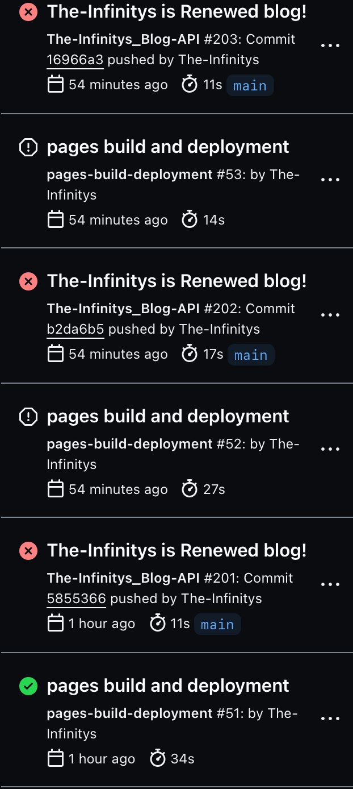

# 自分でAPI(?)作ってみた！
どもども！最近急激に暑くなってきましたね...The Infinitysです！

こうやってブログ見ていてくれるみなさん(多分0人)のおかげでこうやってぼちぼち進められています！

前までは手動でブログのデータ(例えば、どこのリポジトリのどこにどのファイルがあって...)と言ったものを打ち込んでいたのですが、

だんだん面倒くさくなってきてですね...

で目をつけたのがこれです

<a target="_parent" href="https://github.com/features/actions">
## GitHub Actions

</a>

GitHub
Actionsというのは、簡単に言ったら、手動で行なっていたようなテストなどの作業を<a
target="_parent"
href="https://google.com/search?q=.yaml"
>yamlファイル</a
>に記述して

自動でやってくれるというものです

## GitHub Actionsの書き方
GitHub Actionsとは、GitHub Actionsです。

<code>
<pre>name: 名前</pre>
<pre>run-name: actionの名前</pre>
<pre>on: 起動条件</pre>
<pre>jobs:</pre>
<pre>  steps:</pre>
<pre>    - run: command</pre>
<pre>    - run: command</pre>
</code>

まあ、こんな風にして、プログラムとかを記述するのですが、

これが非常に難しい...

これらは(GitHubとか自分とかが用意した)仮想マシン上で実行されるのですが

はい、**コマンドライン**の知識が必須です

lsとかcdとかその他色々とか...

学習する必要があったんですよね...

## 作業工程
まず、リポジトリを作ります

次にルートディレクトリに、".github/workflows"フォルダを設置します

お次にプログラムを書きます

失敗します()

ちなみにその写真がこちら

かれこれ滅茶苦茶時間かかって泣きそうになりました(´・ω・)ﾆﾄﾞﾄﾔﾘﾀｸﾅｲ

一週間ほど調べ続けてついに完成したのがこちら

<a
target="_parent"
href="https://github.com/The-Infinitys/api/blob/main/.github/workflows/blog.yaml"
>https://github.com/The-Infinitys/api/blob/main/.github/workflows/blog.yaml</a
>
たったこれだけ？と思ったみなさん...

<b>
本体はこっちです

</b>
<a
href="https://github.com/The-Infinitys/api/blob/main/programs/blog.py"
target="_parent">
<h2>
https://github.com/The-Infinitys/api/blob/main/programs/blog.py
</h2>
</a>
ここに全てを凝縮しました。

仕組みとしては、

1.リポジトリblog-data(ブログの中身がある場所)をクローンする 
2.探索する 
3.探索結果をもとにオブジェクトを作り上げる 
4.データを(Actions内で)保存する 
5.apiリポジトリにコミットしてプッシュする 

と言った風になってます。ちなみにクロールまで完全自動でやってくれるので滅茶苦茶便利です

疲れた

## orz
