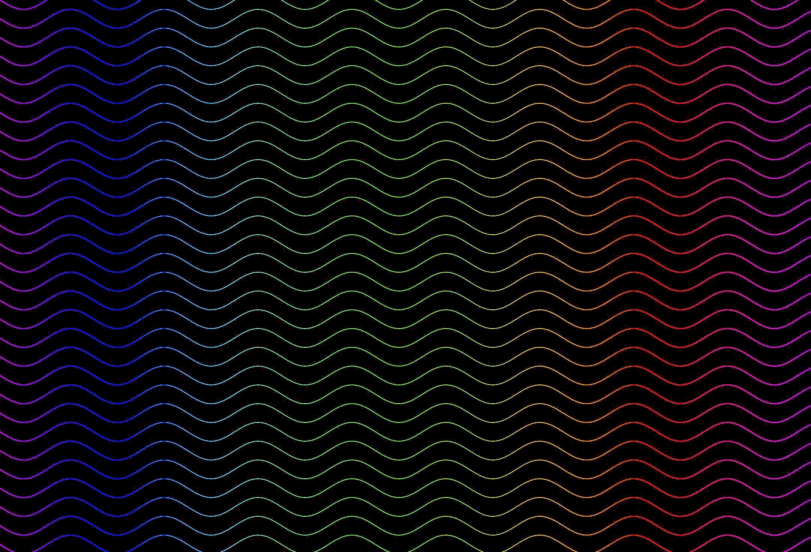

# 乗ろうぜ！このインフィニティウェーブに！
どうも！ The Infinity's です！
今回、新しく背景を制作しました！


## TypeScript
コードはこんな感じです。！
```typescript
const wave_width = 250;
const wave_r = 25;
const pattern: bg_pattern = {
  width: wave_width,
  height: wave_r * 2,
  shift: [0],
  func: (ctx: CanvasRenderingContext2D, x: number, y: number) => {
    ctx.globalCompositeOperation = "destination-out";
    ctx.lineWidth = 1;
    ctx.beginPath();
    ctx.moveTo(x, y);
    for (let i = 0; i < wave_width; i++) {
      ctx.lineTo(
        x + i,
        y + wave_r * Math.sin((2 * Math.PI * i) / wave_width)
      );
    }
    ctx.lineTo(x + wave_width, y);
    ctx.stroke();
    ctx.globalCompositeOperation = "source-over";
  },
};
bg_func.rainbow.run(pattern);
setTimeout(bg_func.rainbow.wave, 100);
```

## この背景を作って
[ツナさん](https://scratch.mit.edu/users/fluffycat_tuna)！ありがとうございました！

# date: 2024/09/19