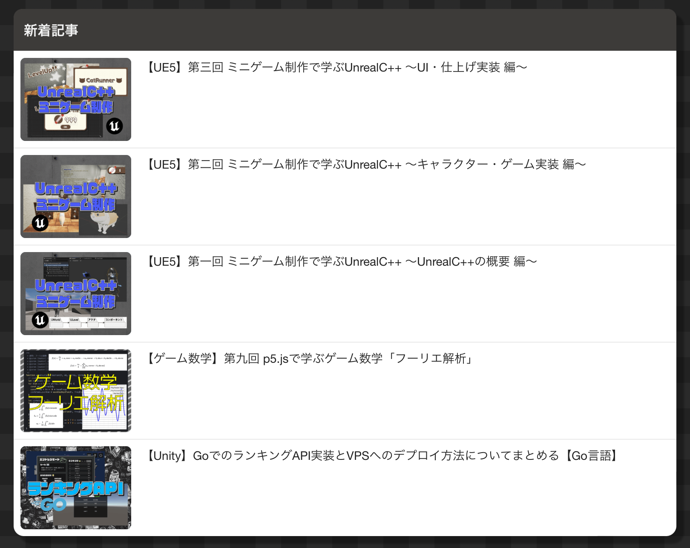

# title: ブログをさらに進化させる

## 前までなかったもの
### 私のブログに足りないもの
他の人のブログを見ていて気になったことがあります。
大体のブログには、ブログ記事を見終わると次の記事が見れるように、ページの最下部の方に
記事のリストがあるのですが、私のものにはそれがない！困ったもんです！というわけで早速作ることにしました！
### 一体何が足りないのだろうか
> <a href="https://elekibear.com/post/20240101_01_next_elekibear"></a>
都会のエレキベアと検索したら出てくるプラスモさんのブログなのですが、
下部に新着記事と書いてあって他の記事へのリンクがあります。
ですが私のブログにはそんなものはありませんでした
٩( ᐛ )وどないしようか

## どうやってやろうか

### 記事が多過ぎた
記事そのものを書き換えようにも既に20以上の記事を書いており、全てに変更を適用するのは余りにも面倒なので、共通スクリプトの[Infinity-style](../../Infinity-style/)に書き足すことで記事リストの追加を図ろうと思います。[blogのscript](../../../blog/script.js)からブログの検索、リンクボタンの追加などのプログラムを取り出し、[Infinity-style/script.js](../../Infinity-style/script.js)に取り入れます。その際に、プログラムの改造を施して、過去2ヶ月の記事の中から月毎にそれぞれ3記事ずつ(合計6つ)の記事を取り出すようにします。そして完成したのがこちら。

### JavaScriptのソース
```javascript
const main = () => {//add article
  const article_text = document.body.innerHTML;
  document.body.innerHTML = "";
  const article_content = document.createElement("div");
  article_content.id = "article-content";
  article_content.innerHTML = article_text;
  const article_body = document.createElement("div");
  article_body.append(article_content);
  document.body.append(article_body);
  //add title
  const title_elem = document.querySelector("title");
  const article_title = document.createElement("div");
  article_title.id = "article-title";
  article_title.innerHTML = "# " + title_elem.innerHTML + "";
  article_body.prepend(article_title);
  //add index
  const article_index = document.createElement("div");
  article_index.id = "article-index";
  article_body.append(article_index);
  for (let i = 0; i < article_content.children.length; ++i) {
    const article_content_child = article_content.children[i];
    const tags = { "H1": "H1", "H2": "H2", "H3": "H3", "H4": "H4" };
    if (article_content_child.tagName in tags) {
      const index_text = document.createElement(article_content_child.tagName);
      index_text.innerHTML = article_content_child.innerHTML;
      index_text.onclick = () => {
        article_content_child.scrollIntoView({
          behavior: 'smooth',
          block: 'end',
          inline: 'center'
        });
      }
      article_index.append(index_text);
    }
  }
  const other_articles = document.createElement("div");
  other_articles.id = "other-articles";
  article_body.append(other_articles);
  const get_all_article_info = () => {
    const blog_start = {
      year: 2024,
      month: 4
    }
    let today = new Date();
    today = {
      year: today.getFullYear(),
      month: today.getMonth() + 1
    }
    const data_list_length = 1 + 12 * (today.year - blog_start.year) + today.month - blog_start.month;
    const domain = new URL(window.location.href);
    const blog_domain = domain.hostname;
    const append_blog_button = info => {
      const box = document.createElement("button");
      box.classList.add("blog-button");
      box.onclick = () => {
        window.location.href = info.index;
      }
      const thumbnail = document.createElement("img");
      thumbnail.src = info.thumbnail;
      thumbnail.alt = info.name;
      thumbnail.loading = "lazy";
      const loading = document.createElement("img");
      loading.src = "data:image/svg+xml;base64,PHN2ZyAgIHZlcnNpb249IjEuMSIgICB4bWxucz0iaHR0cDovL3d3dy53My5vcmcvMjAwMC9zdmciICAgdmlld0JveD0iLTYwIC02MCAxMjAgMTIwIiAgIGZpbGw9Im5vbmUiICAgc3Ryb2tlPSIjNzc3Ij4gICA8Zz4gICA8YW5pbWF0ZVRyYW5zZm9ybSAgICBhdHRyaWJ1dGVOYW1lPSJ0cmFuc2Zvcm0iICAgICBhdHRyaWJ1dGVUeXBlPSJYTUwiICAgICB0eXBlPSJyb3RhdGUiICAgICBmcm9tPSIwIDAgMCIgICAgIHRvPSIzNjAgMCAwIiAgICAga2V5VGltZXM9IjA7IDEiICAgICBrZXlTcGxpbmVzPSIwLjUsIDAuMjMsIDAuNSwgMC43NyIgICAgIGNhbGNNb2RlPSJzcGxpbmUiICAgICBkdXI9IjJzIiAgICAgcmVwZWF0Q291bnQ9ImluZGVmaW5pdGUiLz4gICA8YW5pbWF0ZSAgICAgICBhdHRyaWJ1dGVOYW1lPSJzdHJva2UiICAgICAgIHZhbHVlcz0iI2YwMDsjZmYwOyMwZjA7IzBmZjsjMDBmOyNmMGY7I2YwMCIgICAgICAgZHVyPSI1cyIgICAgICAgcmVwZWF0Q291bnQ9ImluZGVmaW5pdGUiIC8+ICAgPGVsbGlwc2UgY3g9Ii0yNSIgY3k9IjAiIHJ4PSIyNSIgcnk9IjIwIiBzdHJva2Utd2lkdGg9IjIiIC8+ICAgPGVsbGlwc2UgY3g9IjI1IiBjeT0iMCIgcng9IjI1IiByeT0iMjAiIHN0cm9rZS13aWR0aD0iMiIgLz4gICA8Y2lyY2xlIGN4PSIwIiBjeT0iMCIgcj0iNTAiIHN0cm9rZS13aWR0aD0iNCIgLz4gICA8L2c+IDwvc3ZnPiA=";
      loading.alt = "loading...";
      loading.className = "loading-infinity";
      const title = document.createElement("div");
      title.innerHTML = info.title;
      box.innerHTML = loading.outerHTML + thumbnail.outerHTML + title.outerHTML;
      const insert_button = () => {
        document.querySelector("#other-articles").append(box);
      }
      insert_button();
    };
    const getData = (name) => {
      console.log("get: " + name + ".json");
      fetch(name + ".json")
        .then((res) => res.json()).then(
          data => {
            const infos = data.info;
            let counter = 3;
            for (let i = 0; i < infos.length; ++i) {
              const info = infos[i];
              if (Math.random() < 1 / (infos.length - i - counter)) {
                if (counter > 0) {
                  append_blog_button(info);
                  counter--;
                }
              }
            }
          }
        ).catch((err) => console.log(`データが取得できませんでした：${err}`));
    };
    for (let load_count = data_list_length; load_count > data_list_length - 2; --load_count) {
      const pathname = "/api/blog/" + (blog_start.year + ~~((blog_start.month + load_count - 1) / 12)).toString() + "-" + ((blog_start.month + load_count - 2) % 12 + 1).toString()
      getData(pathname);
    }
  };
  get_all_article_info();
  //add style
  fetch("https://" + new URL(window.location.href).hostname + "/layout/style.css").then(res => res.text()).then(style => {
    const The_Infinitys_css = document.createElement("style");
    The_Infinitys_css.innerHTML = style;
    document.body.append(The_Infinitys_css);
  }).catch(err => alert(err));
  fetch("https://" + new URL(window.location.href).hostname + "/layout/script.js").then(res => res.text()).then(style => {
    const The_Infinitys_js = document.createElement("script");
    The_Infinitys_js.innerHTML = style;
    document.body.append(The_Infinitys_js);
  }).catch(err => alert(err));
};
main();
```
### CSSのソース
あとcssも
```css
* {
  margin: 0;
  padding: 0;
}

:root {
  --article-back: #eee;
  --article-text: #000;
}

@media (prefers-color-scheme: dark) {
  :root {
    --article-back: #111;
    --article-text: #fff;
  }

  a {
    color: aqua;
  }
}

body {
  background-color: var(--article-back);
}

#article-title {
  margin-left: 10vw;
  width: 50%;
  height: auto;
  text-wrap: wrap;
  color: var(--article-text);
}

#article-content {
  margin-top: 5vh;
  margin-left: 10vw;
  margin-bottom: 5vh;
  padding: 2%;
  width: 50%;
  height: max(auto, 80vh);
  color: var(--article-text);
  background-color: color-mix(in srgb, var(--article-back), #888 20%);
  overflow: hidden;
  overflow-wrap: break-word;
}

#article-index {
  position: sticky;
  width: 30%;
  height: 70vh;
  bottom: 15vh;
  left: 65%;
  overflow: scroll;
  color: var(--article-text);
  background-color: color-mix(in srgb, color-mix(in srgb, var(--article-back), transparent 50%), #888 10%);
}

#other-articles {
  margin-top: -70vh;
  margin-left: 10vw;
  margin-bottom: 10vh;
  width: calc(50vw + 2 * 2vw);
  aspect-ratio: 8/9;
  background-color: color-mix(in srgb, var(--article-back), #888 20%);
}

.blog-button {
  overflow: hidden;
  position: relative;
  background-color: #ffffff55;

  @media (prefers-color-scheme: dark) {
    background-color: #00000055;
  }

  width:50%;
  aspect-ratio: 4/3;
}

.blog-button img {
  position: absolute;
  top: 0;
  left: 0;
  width: 100%;
  height: 85%;
  object-fit: cover;
}

.loading-infinity {
  position: absolute;
  top: 0;
  left: 0;
  width: 100%;
  height: 85%;
  object-fit: contain;
}

.blog-button div {
  position: absolute;
  width: 100%;
  height: 15%;
  bottom: 0;
  color: var(--text);
  font-size: max(auto, 12px);
}

@media (max-aspect-ratio: 1) {
  #article-index {
    visibility: hidden;
  }

  #article-title {
    margin-left: 2.5vw;
    width: 90%;
  }

  #article-content {
    margin-left: 2.5vw;
    width: 90%;
  }

  #other-articles {
    margin-left: 2.5vw;
    width: 94%;
  }
}

pre {
  position: relative;
  white-space: pre-wrap;
  word-wrap: break-word;
  overflow: auto;
  background-color: color-mix(in srgb, color-mix(in srgb, var(--article-back), transparent 50%), #888 30%);
  color: var(--article-text);
  padding: 10px;
  border-radius: 4px;
  font-size: 15px;
}
```
我ながらかなり難しかった...

## 感想
個人的には大満足の出来でした。ですがやはり今まで貯めてきたプログラムが無ければ作業は難航していたでしょう...
あ、[scratch](https://scratch.mit.edu/projects/1037788134/)にもあるのでよろしく。
